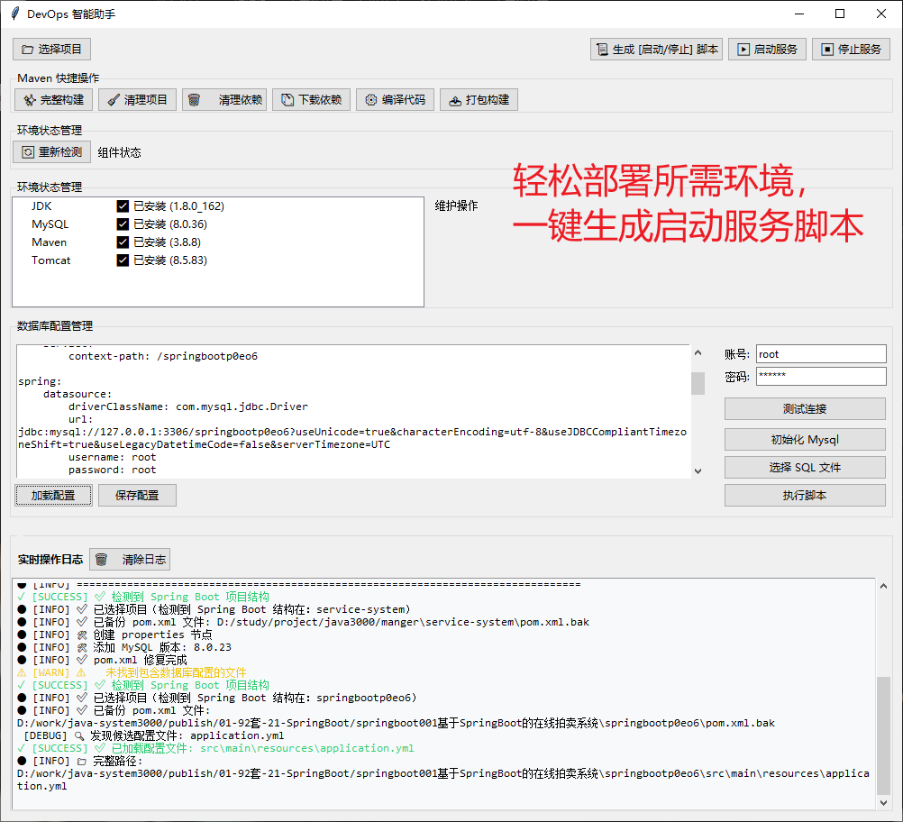

# 高校党支部党务管理系统 / _University_Party_Branch_Management_System


> 更多毕设项目可跳转至项目导航栏检索：[毕设项目](http://sysadmin.3vfree.vip)，需要联系博主v：xq-lucky311，q：1047944234. 备注：项目咨询
注：由于前端项目太大，仅上传了后端代码，未包含前端代码...

## 项目简介  
基于SpringBoot + MyBatis Plus + Shiro的党务管理系统，实现党员管理、组织活动、思想汇报、在线考核等核心功能，支持多级审核流程与文件管理，满足高校党支部数字化管理需求。

## 特征介绍  
- **RBAC权限控制**：集成Shiro实现角色/菜单动态权限管理，支持精细化操作控制。  
- **多源数据集成**：MyBatis Plus + MySQL/Oracle双驱动，支持SQL Server扩展连接。  
- **文件管理体系**：封装FileUtil实现长文本/文件存储，支持百度AI内容识别。  
- **工作流引擎**：内置sfsh审核状态机，支持发展对象/预备党员多级审批流程。  
- **考核评测系统**：集成POI实现试题导入导出，支持在线测试与自动评分。  

## 代码结构 
```
src/
├── main/
│   ├── java/
│   │   ├── com/
│   │   │   ├── SpringbootSchemaApplication.java
│   │   │   ├── annotation/          
│   │   │   ├── config/              
│   │   │   ├── controller/          
│   │   │   ├── dao/                 
│   │   │   ├── entity/              
│   │   │   │   ├── model/           
│   │   │   │   ├── view/            
│   │   │   │   ├── vo/              
│   │   │   ├── interceptor/         
│   │   │   ├── service/             
│   │   │   │   ├── impl/            
│   │   │   ├── utils/               
│   ├── resources/
│   │   ├── mapper/                  
│   │   ├── application.yml          
│   │   ├── static/
│   │   │   ├── upload/

## 使用说明
开发语言：  
框架：SpringBoot  
JDK版本：JDK1.8  
服务器：Tomcat7  
数据库：MySQL 5.7  
数据库工具：Navicat11  
开发软件：eclipse/myeclipse/idea  
Maven包：Maven3.3.9  
浏览器：谷歌浏览器  
配置环境安装包：[配置环境](链接3) (访问码：pfd5)  
后台路径地址：localhost:8080/项目名称/admin/dist/index.html  
前台路径地址：localhost:8080/项目名称/front/dist/index.html  
管理员账号：admin  
管理员密码：admin
```

# 项目实际截图：
## 登录：


## 前台：


## 后台：


> 等等...

# 精选项目导航 & 快速部署工具
## 项目资源一站直达
- ​**访问项目导航站**：[点击进入](http://sysadmin.3vfree.vip)**快速检索所需项目名称**
- ​**技术栈全覆盖**：/SSm/Spring Boot/小程序等主流技术方案
- ​**配套资源**：每个项目均提供部署文档 + 演示视频（附效果截图）

### ▌导航站预览


### ▌工具界面预览


## 捐赠
> 博主将持续更新全栈开发项目，包含ssm，springboot，前后端分离系统等项目。
> 此外如果您够宽裕，请博主喝杯咖啡吧！捐赠将用于服务器维护与开源社区建设，感谢您的认可！
> 如需更多相关项目毕设3000+，有其他项目需求，sql文件等可联系博主v:xq-lucky311

---